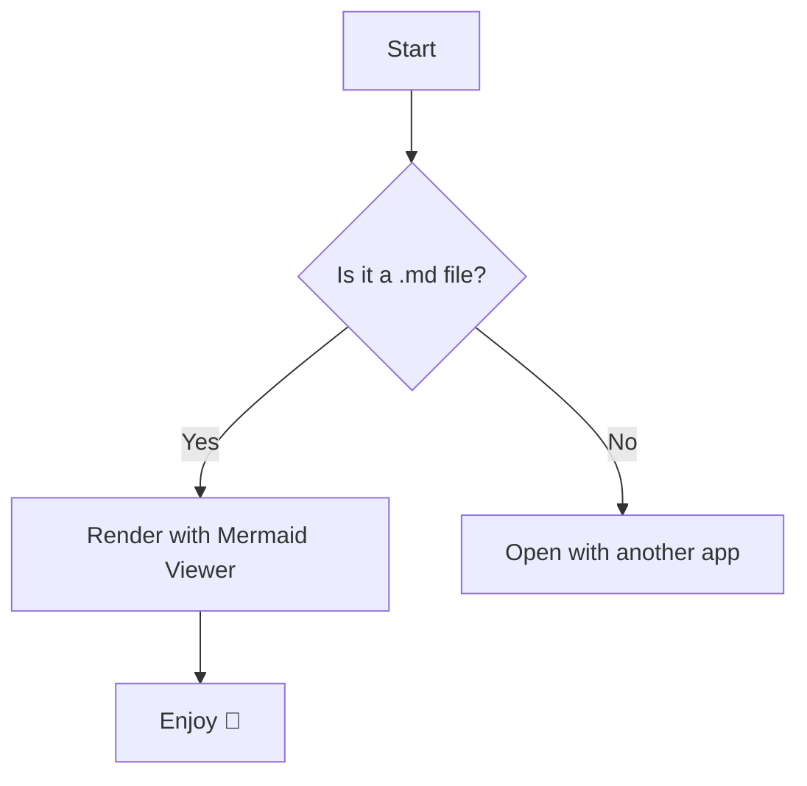
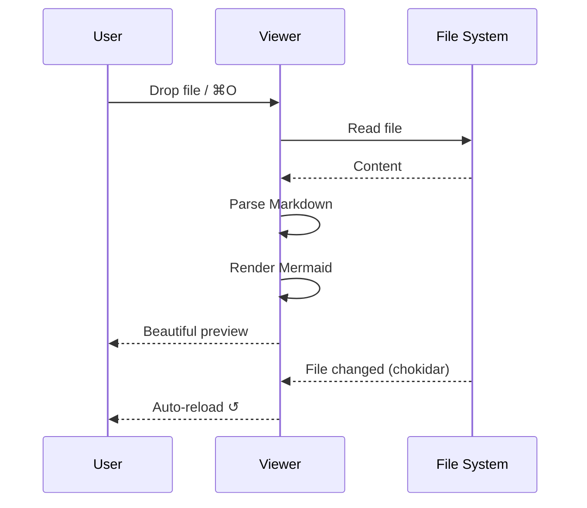
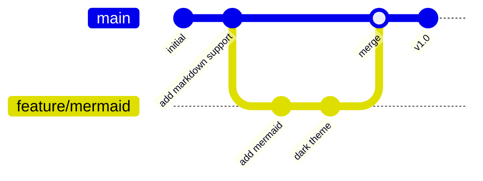
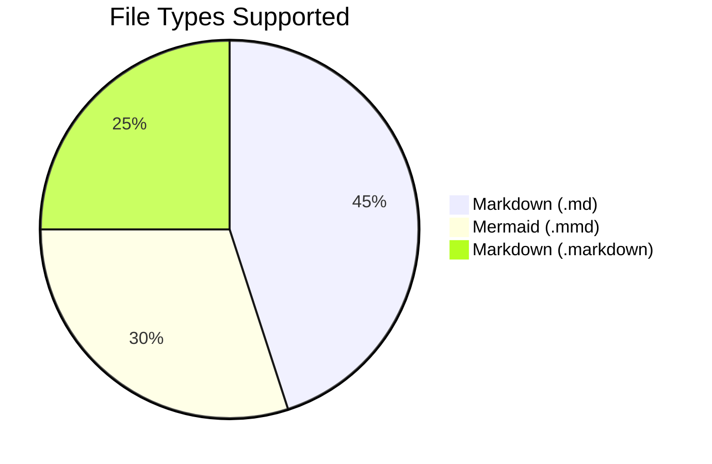
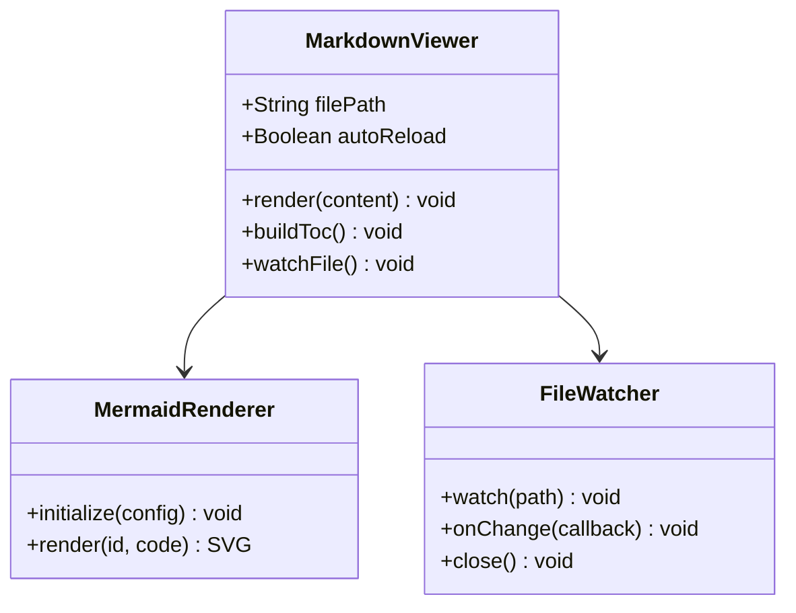

# Mermaid Markdown Viewer — Sample

Welcome! This file demonstrates everything the viewer can render.

---

## Flowchart



---

## Sequence Diagram



---

## Git Graph



---

## Tables

| Feature          | Status  | Notes                        |
|------------------|---------|------------------------------|
| Markdown render  | ✅ Done | via `marked`                 |
| Mermaid diagrams | ✅ Done | via `mermaid.js`             |
| Syntax highlight | ✅ Done | via `highlight.js`           |
| Auto-reload      | ✅ Done | via `chokidar`               |
| TOC sidebar      | ✅ Done | auto-built from headings     |
| Drag & drop      | ✅ Done | drop `.md` onto the window   |
| Search (⌘F)      | ✅ Done | with prev/next navigation    |
| Zoom (⌘+/-)      | ✅ Done | scales rendered text         |

---

## Code Blocks

```typescript
interface DiagramConfig {
  theme: 'dark' | 'light';
  autoReload: boolean;
  watchPath: string;
}

async function renderDiagram(config: DiagramConfig): Promise<SVGElement> {
  const { svg } = await mermaid.render('diagram', config.watchPath);
  return svg;
}
```

---

## Task List

- [x] Flowcharts
- [x] Sequence diagrams  
- [x] Git graphs
- [x] Pie charts
- [x] Class diagrams
- [ ] Export to PDF *(coming soon)*

---

## Pie Chart



---

## Blockquote

> **Tip:** Save this file and edit it — the viewer will **auto-reload** instantly whenever you save changes.

---

## Class Diagram


